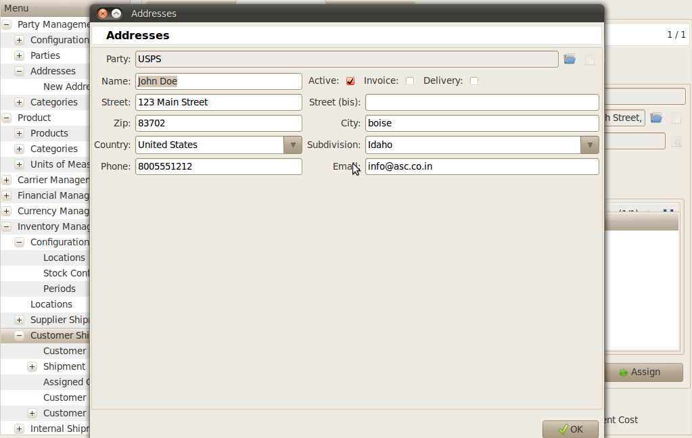
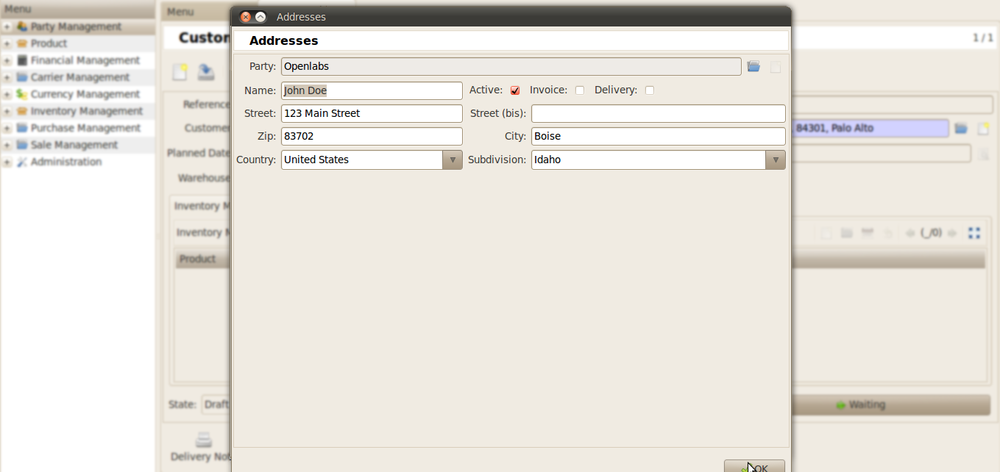

Address
#######

Endicia Integration with BFA Customisation.
*******************************************

For Endicia Integration *Warehouse address* and *Delivery address* should be different but country should be same (United States).
Go To *Inventory Management >> Customer Shipment >> Warehouse >> Address*

Warehouse Address
"""""""""""""""""

Delivery Address
""""""""""""""""
    
Go To *Inventory Management >> Customer Shipment >> Delivery Address*
    

    

Endicia Integration without BFA Customisation module.
*****************************************************

When bfa_customisation module is not installed, then *Phone* and *Email* field are not there in *Addresses*.

