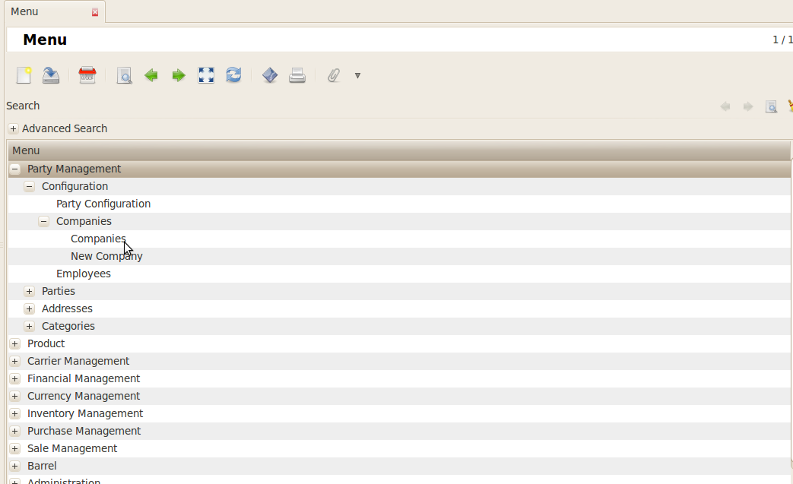
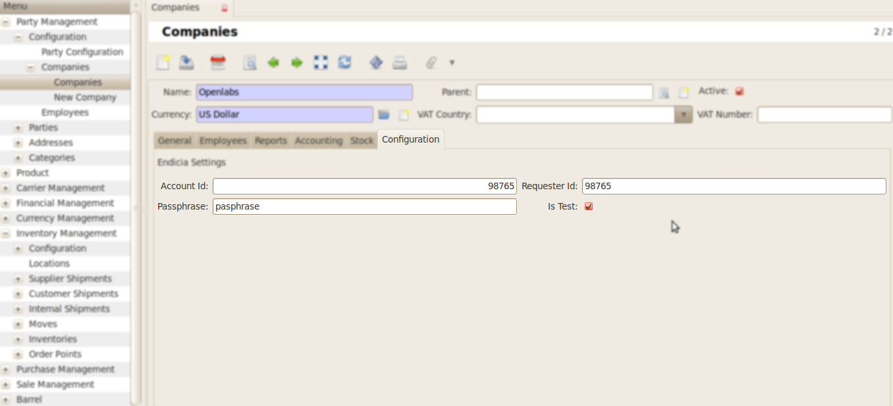

Configuration for Company
#########################
For configuring the company , go to *Party management >> Configuration >> Companies*.

    
In Configuration Tab, fill the following fields for endicia integration:

* Account Id : Account ID for the Endicia postage account
* Requester Id : Uniquely identifies the system making the request. Endicia assigns this ID
* Passphrase : Passphrase for the Endicia postage account
* Is Test : Yes - Use Sample Postage for testing
            No - Use Real Postage

