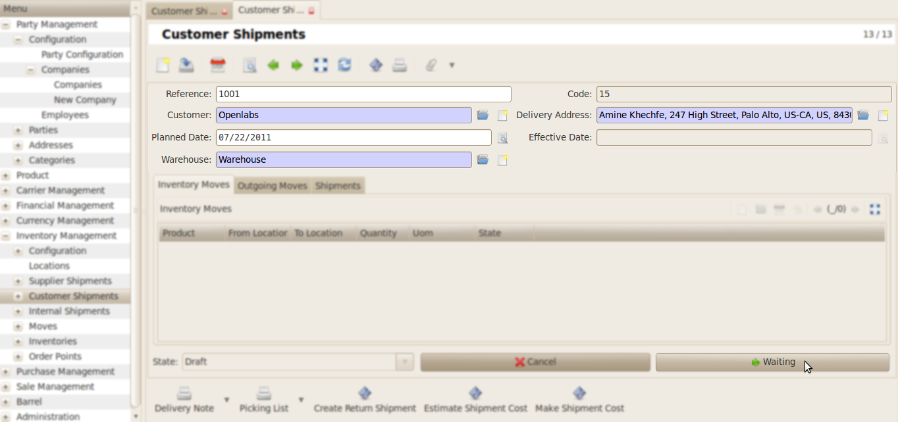
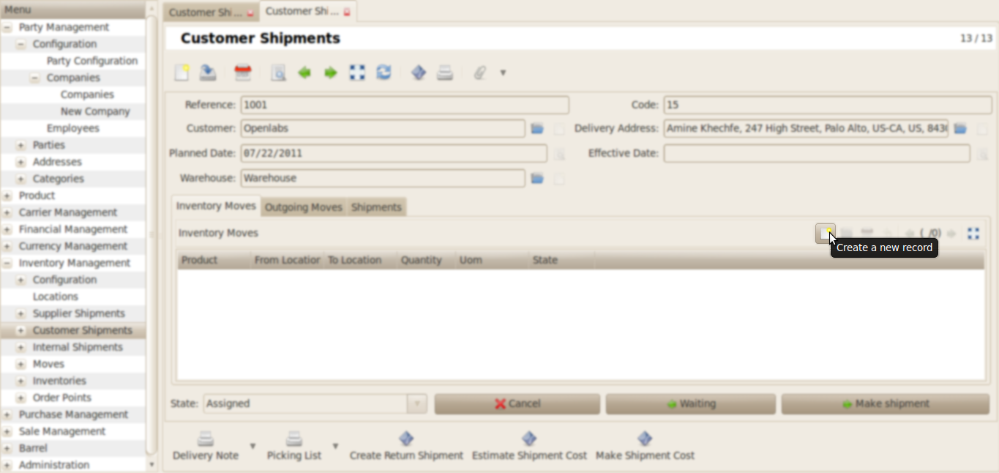
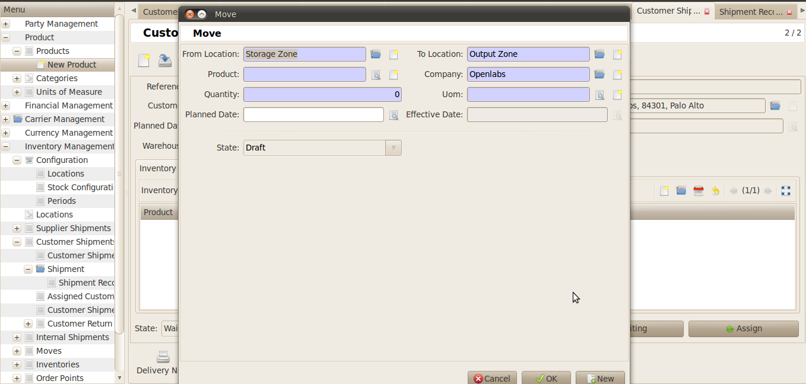
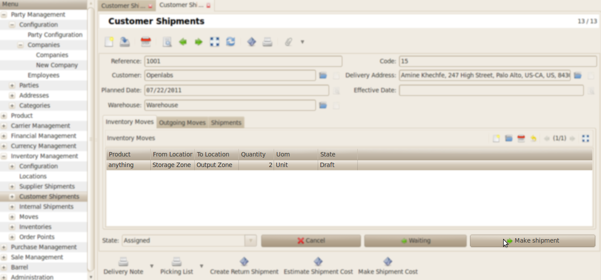
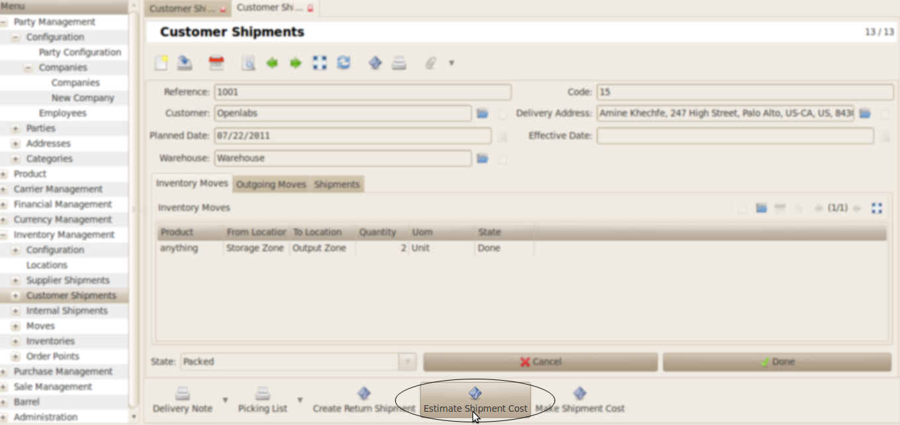
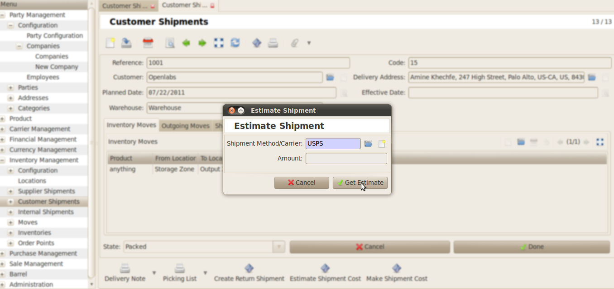
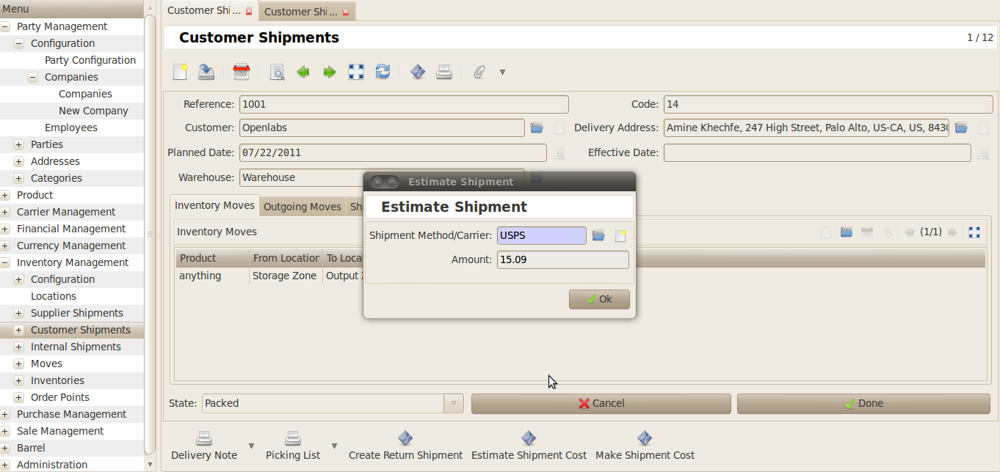
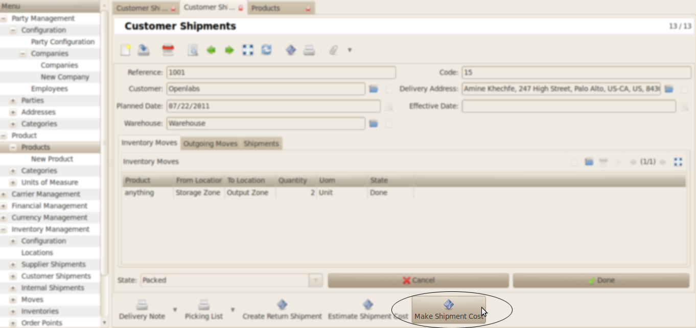
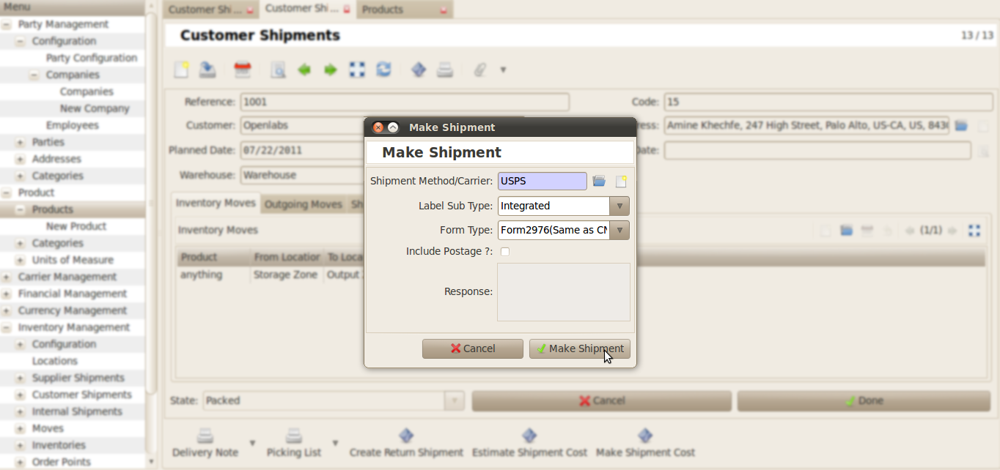
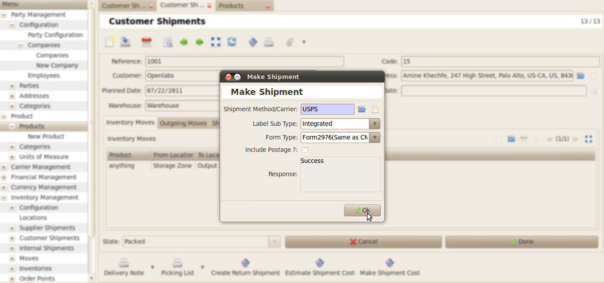

Customer Shipment
#################

Go to the *Inventory Management >> Customer Shipments*.

Fill the required fields and click on **Waiting** button.

    
Now create the new record under the **Inventory Moves** Tab.

\

When the product is selected click on **Make Shipment** button.

Now click on **Estimate Shipment Cost**.

Select the **Shipment Method/Carrier**. And click the *Get Estimate* button.

Now the pop-up window will display the **Estimate Shipment Amount**.

    
Now for the shipment cost click on **Make Shipment Cost**. 

    
Fill the following fields:

* Shipment Method/Carrier
* Label Sub Type
* Form Type

And click on **Make Shipment** 

    
After all the fields are configured correctly **Response** field will show success message.
    

