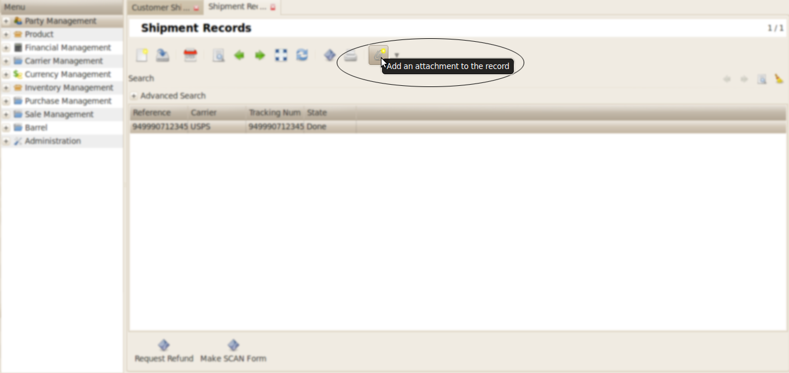
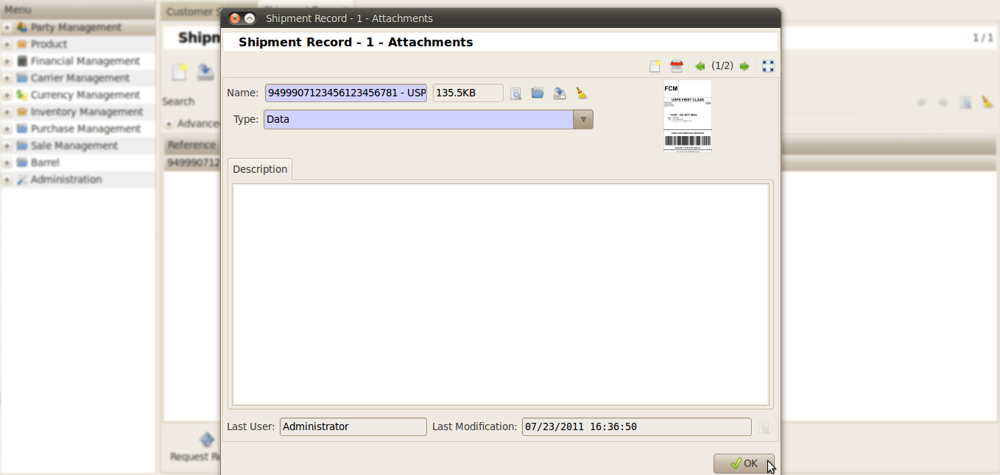

Customer Shipment
#################

Go to the *Inventory Management >> Customer Shipments*.

Create some product moves for shipment.

.. image:: _images/5.png
    :width: 1000

.. note:: For Shipment through *Endicia* *Delivery Address* and *Warehouse* address are needed. By default *Delivery Address* is considered as customer's address.

Now assign products for shipment. 

.. image:: _images/e.png
    :width: 1000

For assigning the product to shipment click on **Make Shipment** button for *Outgoing Moves*.

.. image:: _images/6.png
    :width: 1000

After the product is in *Outgoing Move* click on **Estimate Shipment Cost** for getting the estimated shipment cost, state of the product is converted to *Packed*.

.. image:: _images/7.png
    :width: 1000

Select the *Shipment Method/Carrier*. And click the **Get Estimate** button.

.. image:: _images/8.png
    :width: 1000

Now the pop-up window will display the **Estimate Shipment Amount**.

.. image:: _images/9.png
    :width: 1000
    
For shipment click on **Make Shipment Cost**. 

.. image:: _images/11.png
    :width: 1000
    
Fill the following fields:

* Shipment Method/Carrier : Describes various methods of shipment.
* Label Sub Type
* Form Type

And click on **Make Shipment** 

.. image:: _images/12.png
    :width: 1000
    
After all the fields are configured correctly **Response** field will show success message.
    
.. image:: _images/13.png
    :width: 1000
     
To check the label for shipment records, go to *Inventory Management >> Customer Shipments >> Shipment >> Shipment Records*.

    
\

