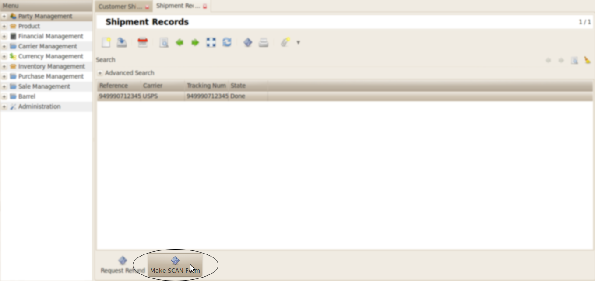
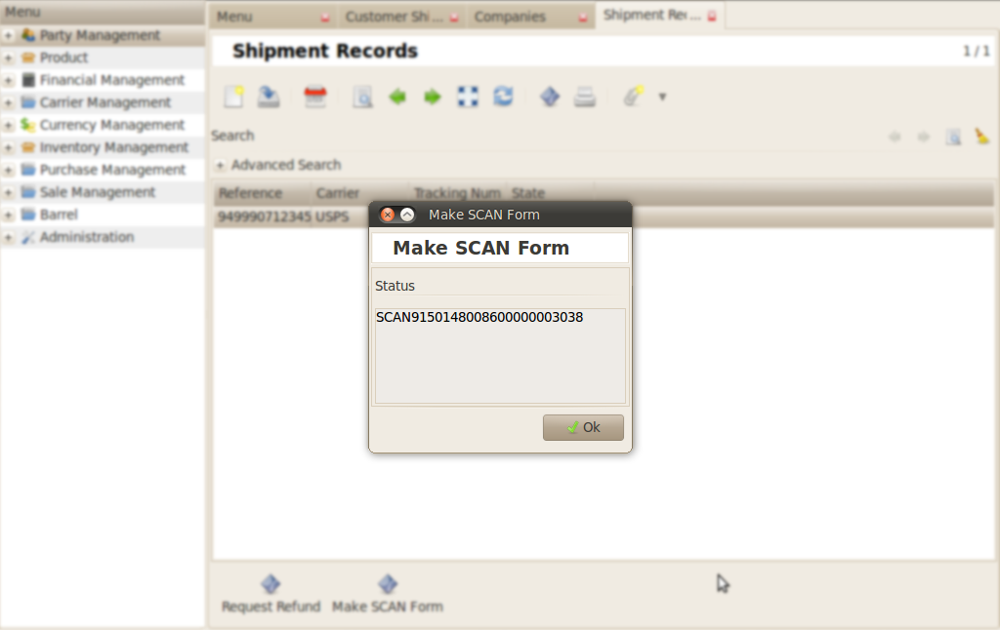
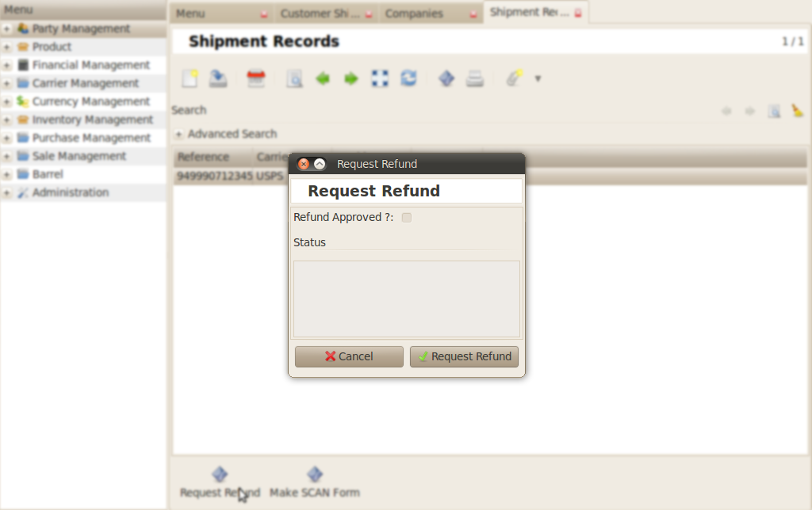

Shipment Records
################

SCAN Form
*********

Go to *Inventory Management >> Customer Shipment >> Shipment >> Shipment Records* .

Click the **Make Scan Form**.

    
.. note:: For scan form we have to create a folder in tryton workspace for the attachment.
          

Request Refund
**************

If you want to cancel the shipment request , then click **Request Refund**.

    
.. note:: If the shipment is less than 10 days then only it can be refunded, otherwise not.

.. image:: _images/d.png
    :width: 1000

