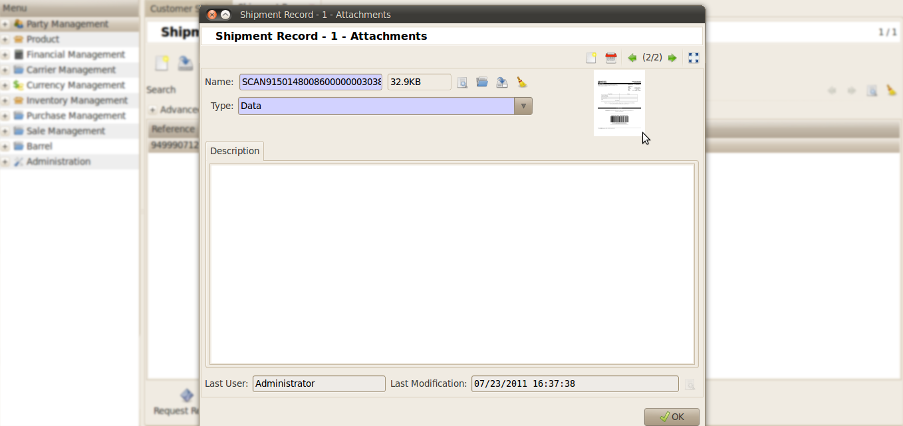

Shipment Records
################

SCAN Form
*********

Go to *Inventory Management >> Customer Shipment >> Shipment >> Shipment Records* .

Click the **Make Scan Form**.

.. image:: _images/14.png
    :width: 1000
    
.. note:: For scan form we have to create a folder in tryton workspace for the attachment.
          
.. image:: _images/b.png
    :width: 1000
    
To check the scan form in tryton go to, *Inventory Management >> Customer Shipments >> Shipment >> Shipment Records*.

Request Refund
**************

If you want to cancel the shipment request , then click **Request Refund**.

.. image:: _images/c.png
    :width: 1000

/

.. image:: _images/d.png
    :width: 1000

