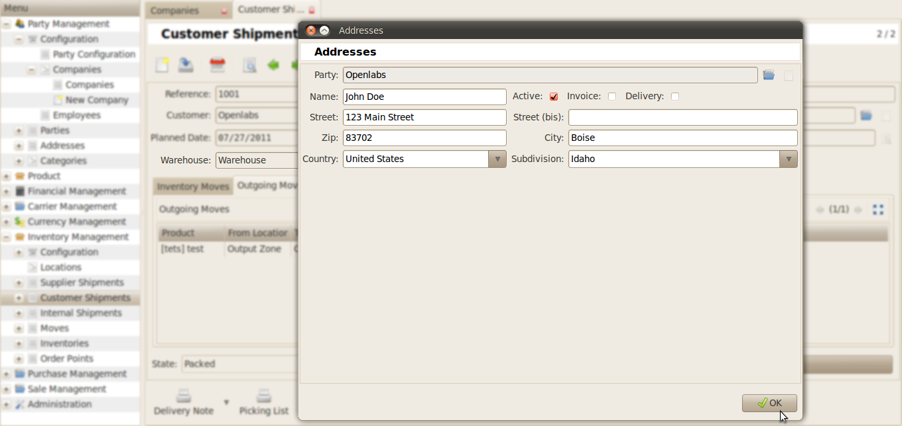
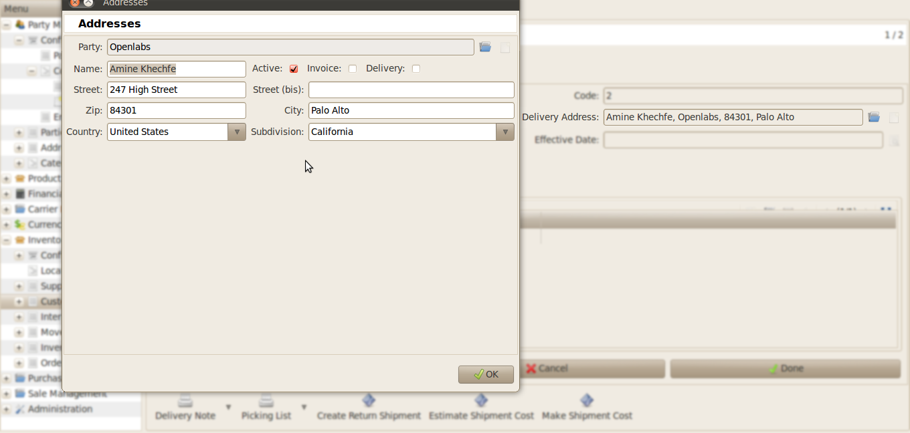

Address
#######

For making a shipment through USPS using Endicia, `Warehouse Address` is 
required, which acts as the sender's address. The delivery address defaults 
to the customer's address.  

Warehouse Address
"""""""""""""""""

Delivery Address
""""""""""""""""
    
Go To *Inventory Management >> Customer Shipment >> Delivery Address*
    

