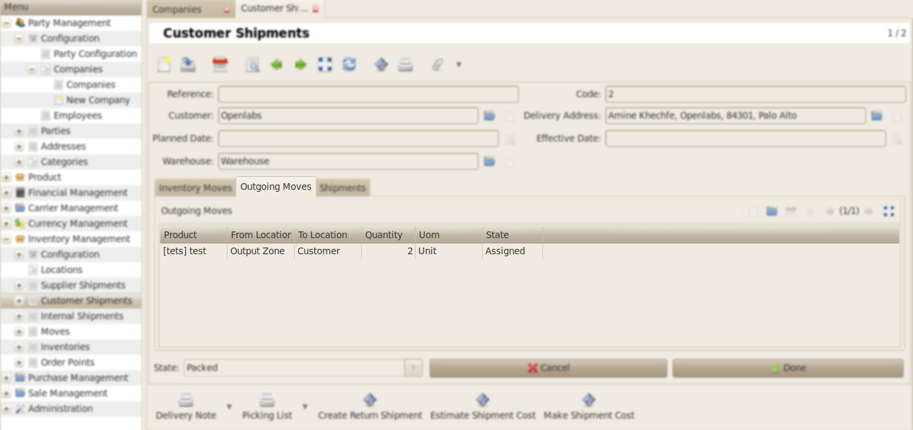
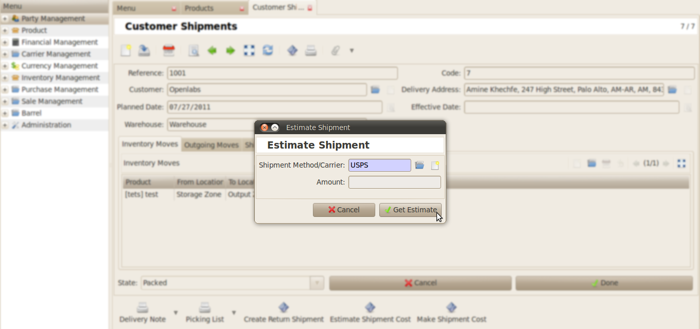
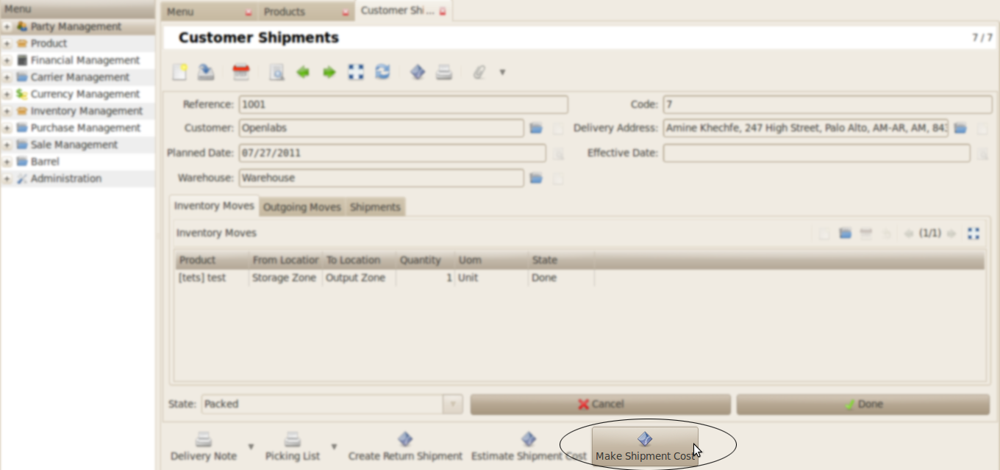
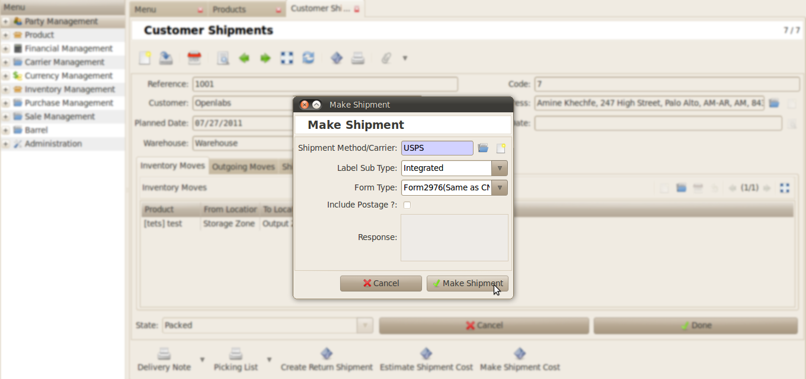
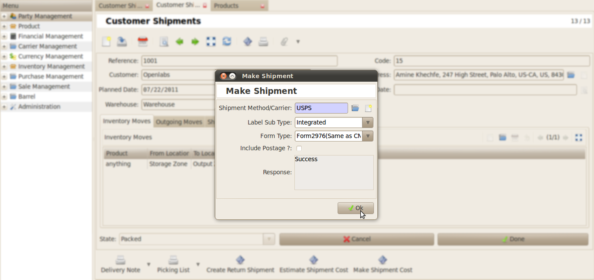
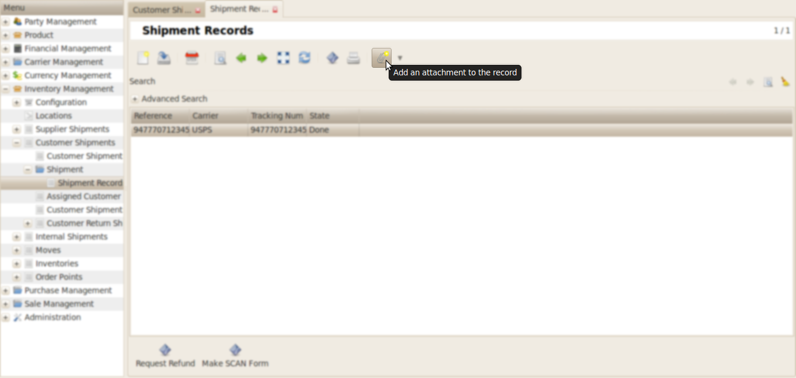
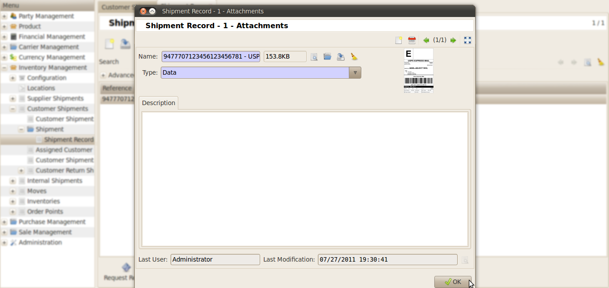

Customer Shipment
#################

For the shipment through USPS using Endicia, *Outgoing Moves* should be 
present in a `Customer Shipment`. 

Click on **Estimate Shipment Cost** for getting the estimated shipment cost 
if the shipment has to be done using USPS(Endicia).

.. image:: _images/7.png
    :width: 1000

Select the *Shipment Method/Carrier*. And click the **Get Estimate** button.

Now the pop-up window will display the **Estimate Shipment Amount**.

.. image:: _images/9.png
    :width: 1000
    
For shipment click on **Make Shipment Cost**. 

    
Fill the following fields:

* Shipment Method/Carrier : Describes various methods of shipment.
* Label Sub Type
* Form Type

And click on **Make Shipment** 

    
After all the fields are configured correctly **Response** field will show success message, else error message will be displayed.
    

     
To check the label for shipment records, go to *Inventory Management >> Customer Shipments >> Shipment >> Shipment Records*.

    
\

